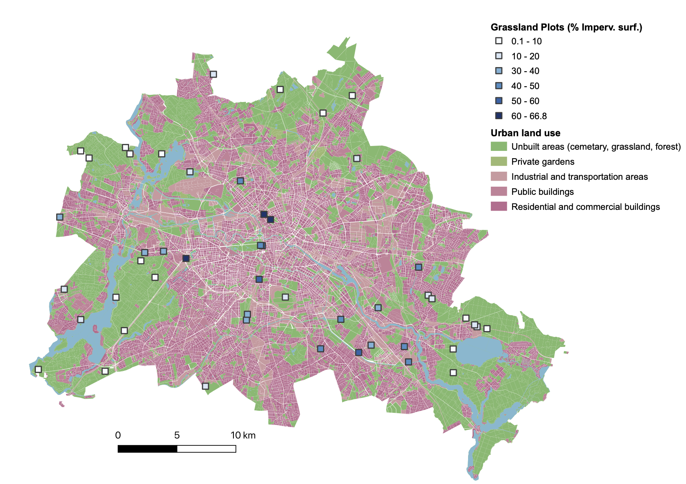

This page runs the analyses for the article in preparation entitled **Allergens in grasslands increase with urbanisation and plant invasions** by Maud Bernard-Verdier et al.


```{r setup, echo=FALSE, message=FALSE,verbose=FALSE}
library(knitr)

knitr::opts_chunk$set(echo= FALSE, message=FALSE, verbose=FALSE, 
   dev= 'png', 
   fig.width = 4, fig.height = 3,  fig.align='center',
   out.width = "70%",
   fig.show='hold', cache=TRUE, par=TRUE)
```


```{r Initiate, warning=FALSE, echo=FALSE, verbose=FALSE, include = FALSE}
Sys.setlocale("LC_TIME", "en_US")

# _________ Load useful R packages:  ___________________

library(data.table)  
library(sp)    
library(leaps) 
library(vegan)

library(tidyr)
library(MuMIn)
library(r2glmm)
library(performance)
library(rsq)
library(MASS)
library(lme4)
library(np)
library(DescTools)
library(sp)
library(ape)

# color and graphical packages: 
library(inlmisc)
library(ggplot2)
library(vioplot)

# Load Data and results:
 load("results/Urban_Grassland_Allergens_results.Rdata")
 print(paste("Allergen analyses from", file.info("results/Urban_Grassland_Allergens_results.Rdata")$ctime, "was loaded"))
 

# My own utility functions:
source('scripts/utils/add.stats.R')
source('scripts/utils/p2star.R')
source('scripts/utils/cor.print.R')

# load specific functions to fit GLMs to our data: 
source('scripts/Analyses/fit.allergen.glms.R')


```

{width=80%}

# Data overview

*Species in data*: `r nrow(species_allergen)` species, from `r length(unique(species_allergen$Genus))` genera and `r length(unique(species_allergen$family))` families.

`r length(natives)` natives (`r round(length(natives)/nrow(species_allergen),2) *100`%), `r length(neophytes)` neophytes (`r round(length(neophytes)/nrow(species_allergen),2) *100`%), `r length(archaeophytes)` archaeophytes (`r round(length(archaeophytes)/nrow(species_allergen),2) *100`%).

### Cityscapelab Berlin gradient correlations
```{r gradients, echo=FALSE, message=FALSE, warning=FALSE, verbose=FALSE}

# correlations plot_summary
# 
# cor.gradients <- cor.print(plot_summary[, c("Seal_500","prop.neo","BNIs","Pop_500","Rao",
#                            "SR")], return.print = FALSE)
cor.table <- cor.print(plot_summary[, c("Seal_500","prop.neo","BNIs","Pop_500","Rao",
                           "SR")], return.print = TRUE)
knitr::kable(cor.table, format ="markdown",
             digits = 4,
             caption = "Spearman correlations between key variables")
```

### Species allergenicity
```{r sp.allergenicity, echo=FALSE, message=FALSE, warning=FALSE, verbose=FALSE}

# Species allergenicity count

# test allergenicity of wind pollinated species: 
all.anem <- table(all = species_allergen$allergenicity,
                  anem = species_allergen$anemophilous)       
## 55 times more likely to be allergenic when anemophilous
anem.t <- fisher.test(all.anem) 

score.anem <- table(all = species_allergen$allergen_score,
                  anem = species_allergen$anemophilous)       
## 55 times more likely to be allergenic when anemophilous
anem.G <- DescTools::GTest(score.anem) 

# test effect of taxonomic family:
all.taxo<- table(all = species_allergen$allergenicity ,
                 fam = species_allergen$family)   
perc.all.taxo <- round(all.taxo[2,]/colSums(all.taxo),2)*100
## Gtest (likelihodd ratio test)
family.G <- GTest(all.taxo)

# Summarise molecule numbers per species

## number of unique molecules attributed at species level (match = 1)
nb.mol.strict <- unique(
  molecule_data_raw$Allergen.simple.old[
    which(molecule_data_raw$init.match == "1")])
sp.mol.strict <- unique((molecule_data_raw$Species[
  which(molecule_data_raw$init.match == "1")]))

# molecules attribeted at species level (match = 1)
nb.mol.broad <- unique(molecule_data_raw$Allergen.simple)
sp.mol.broad <- unique((molecule_data$Species))

## Check unassigned molecules in the broad sense (genus level):
assigned <- species_allergen[allergenics,"known.mols"]
unassigned <-  species_allergen[allergenics,"molecule.unknown"]

unassigned.table  <- table(
  neophytes = species_allergen[allergenics,"neophyte"], 
  unassigned = unassigned)
unassigned.table <- unassigned.table/rowSums(unassigned.table)

# correlation number of molecule vs allergen score
tmp <- data.frame(nmol = assigned, 
             score= species_allergen[allergenics,]$allergen_score)
# tmp <- tmp[tmp$nmol >0,] # to remove species with no known molecule
mol.score <- cor.test(~nmol + score, data = tmp,
                      method = "spearman")

# plot(jitter(score) ~ jitter(nmol), data = tmp,
#      xlab = "Recorded molecules per allergenic species",
#      ylab = "Allergenicity score")
# add.stats(mol.score, output = FALSE)


# mean allergen molecule numbers per species in each family
mol.sp.taxo <- data.frame(
  mean = tapply(assigned, 
                INDEX = species_allergen[allergenics,]$family,
                mean),
  sd= tapply(assigned, 
             INDEX = species_allergen[allergenics,]$family,
             sd),
  median = tapply(assigned, 
                  INDEX = species_allergen[allergenics,]$family,
                  median),
  max = tapply(assigned, 
               INDEX = species_allergen[allergenics,]$family,
               max),
  min = tapply(assigned, 
               INDEX = species_allergen[allergenics,]$family,
               min)
  
)

```


* Strict species level: `r length(nb.mol.strict)` unique molecules found for `r length(sp.mol.strict)` out of `r sum(species_allergen$allergenicity_strict == 1)` allergenic species.

* Broad definition: `r length(nb.mol.broad)` unique molecules found for `r length(sp.mol.broad)` out of `r sum(species_allergen$allergenicity == 1)` allergenic species.

Overall, `r sum(species_allergen$allergenicity)` allergenic species (`r round(sum(species_allergen$allergenicity)/length(species_allergen$allergenicity),3)*100`% of all recorded species) were found in the vegetation plots, of which `r sum(assigned>0)` were assigned known allergen molecules. 

The number of allergen molecules identified per allergenic species ranged from `r min(assigned[assigned>0])` to `r max(assigned[assigned>0])` (median = `r median(assigned[assigned>0])`, mean = `r round(mean(assigned[assigned>0]),2)`, sd = `r round(sd(assigned[assigned>0]),2)`). Overall, the higher the number of allergens per species, the higher the allergenicity score of the species (Spearman rank correlation: rho = `r round(mol.score$estimate[[1]],2)`, n = `r sum(assigned>0)`, P =`r round(mol.score$p.value,4)`).

Pollination syndrome and taxonomic family were the best predictors of species allergenicity. Wind-pollinated species, which represented `r round(sum(species_allergen$anemophilous)/nrow(species_allergen),2)*100`% of all species, were `r round(anem.t$estimate[1])` times more likely to be allergenic than species with other pollination modes (Fisher exact test: odds.ratio = `r round(anem.t$estimate[1],2)`, P = `r round(anem.t$p.value,4)`) and tended to have higher allergen scores (G-test: G = `r round(anem.G$sta,2)` , df = `r round(anem.G$param,2)`,  P = `r round(anem.G$p.value,4)`). 

Allergenic species were over-represented in certain plant families (G-test: G = `r round(family.G$stat,2)` , df = `r round(family.G$param,2)`,  P = `r round(family.G$p.value,4)`), with allergenic species restricted to `r sum(all.taxo[2,]>0)` out of `r ncol(all.taxo)` plant families. Allergenics were particularly over-represented in the Poaceae (`r all.taxo[2,"Poaceae"]` allergenic species; representing `r  perc.all.taxo["Poaceae"]`% of family members, cf. Methods section), Cyperaceae (`r all.taxo[2,"Cyperaceae"]`;  `r perc.all.taxo["Cyperaceae"]`%), Chenopodiaceae (`r all.taxo[2,"Chenopodiaceae"]`;  `r perc.all.taxo["Chenopodiaceae"]`%), Fabaceae (`r all.taxo[2,"Fabaceae"]`;  `r perc.all.taxo["Fabaceae"]`%), Asteraceae (`r all.taxo[2,"Asteraceae"]`;  `r perc.all.taxo["Asteraceae"]`%), and Plantaginaceae (`r all.taxo[2,"Plantaginaceae"]`;  `r perc.all.taxo["Plantaginaceae"]`%). Allergenic species from the same taxonomic family tended to produce allergens from the same biochemical families (Figure S1; Permanova: $R^2$ = `r round(adonis.mol.fam$R2[1],2)`, F = `r round(adonis.mol.fam$F[1],2)`, P = `r round(adonis.mol.fam$P[1],2)`), although that pattern was no doubt exacerbated by our decision to assign common allergens at the genus or the tribe level. The highest number of allergen molecules per species tended to be in the Plantaginaceae (median =  `r mol.sp.taxo["Plantaginaceae","median"]`, max = `r mol.sp.taxo["Plantaginaceae","max"]`), Poaceae (median =  `r mol.sp.taxo["Poaceae","median"]`, max = `r mol.sp.taxo["Poaceae","max"]`) and Asteraceae (median =  `r mol.sp.taxo["Asteraceae","median"]`, max = `r mol.sp.taxo["Asteraceae","max"]`) families.


### Allergenicity of non-natives

```{r alien.allergenicity, echo=FALSE, message=FALSE, warning=FALSE, verbose= FALSE}
# Allergenic species per floristic status
status.all<- table(species_allergen[,c( "Introduction_status_Seitz2012",
                                   "allergenicity")])
status.all.G <- DescTools::GTest(status.all)
#G = 0.44836, X-squared df = 2, p-value = 0.7992
p.status.all <- round((status.all/rowSums(status.all))[,2],3)*100

# Allergen score per floristic status
tmp <- table(species_allergen[,c( "Introduction_status_Seitz2012", "allergen_score")])
status.score <-  DescTools::GTest(tmp)
# G = 10.054, X-squared df = 8, p-value = 0.2612

# PAV per floristic status
# select allergenics only (avoid two many zeros)
tmp <- species_allergen[allergenics,]
# Negative binomial regression (best fit so far)
fnb.fam <- add.stats(glm.nb(PAV ~ as.factor(Introduction_status_Seitz2012),
         data = tmp), plot.abline = FALSE, add.text2plot = FALSE)

# Numper of allergen per species by Status: 
tmp <- species_allergen[which(species_allergen$known.mols >0),]
# Poisson regression (best fit so far)
f.all.num <- add.stats(
 glm(known.mols ~ as.factor(Introduction_status_Seitz2012),
         data = tmp, family = quasipoisson),
plot.abline = "no", add.text2plot = FALSE)
# AER::dispersiontest(f) # poisson was overdispersed

# Number of allergen families per species per floristic status
tmp <- species_allergen[which(species_allergen$known.allfam >0),]
#Poisson regression (best fit so far)
f.all.fam <- add.stats(
 glm(known.allfam ~ as.factor(Introduction_status_Seitz2012),
         data = tmp, family = poisson),
 plot.abline = "no", add.text2plot = FALSE)
# AER::dispersiontest(f) # OK


# Format summary table: 
mol.sp.status <- data.frame(
  mean = tapply(assigned, 
                INDEX = species_allergen[allergenics,]$Introduction_status_Seitz2012,
                mean),
  sd= tapply(assigned, 
             INDEX = species_allergen[allergenics,]$Introduction_status_Seitz2012,
             sd),
  median = tapply(assigned, 
                  INDEX = species_allergen[allergenics,]$Introduction_status_Seitz2012,
                  median),
  max = tapply(assigned, 
               INDEX = species_allergen[allergenics,]$Introduction_status_Seitz2012,
               max),
  min = tapply(assigned, 
               INDEX = species_allergen[allergenics,]$Introduction_status_Seitz2012,
               min)
)

```


```{r accum.allfam, include=FALSE}

# species accumulation curves or allergen molecules per species:
rare.est <- data.frame(matrix(NA,nrow = 3, ncol = 4,
                              dimnames = list(1:3,
                                              c("type", "SR", "mean","sd"))))
for (i in 1:3) {
   pool <- list(natives, archaeophytes, neophytes)
   type <- c("native", "archaeophyte", "neophyte")[i]
   sac <- specaccum(allfam_mat[intersect(pool[[i]],allergenics),], 
                    method = "random", permutations = 10000)
   
   rare.est[i,] <- c(type,10,round(sac$richness[10],2),round(sac$sd[10],2))
}
```

Allergenic species were equally frequent among neophytes (`r p.status.all ["N"]`%), archaeophytes (`r p.status.all ["A"]`%) or native species (`r p.status.all ["I"]`%) in our dataset (G-test: G = `r round(status.all.G$sta,2)` , df = `r round(status.all.G$param,2)`,  P = `r round(status.all.G$p.value,4)`). There was also no difference in potential allergenic values (PAV) (negative binomial GLM: $R^2$ = `r round(fnb.fam$R2,2)`, df = `r round(fnb.fam$df)`, P = `r round(fnb.fam$P,4)`),  in number of allergen molecules per species (Quasipoisson GLM: $R^2$ = `r round(f.all.num$R2,2)`, df = `r round(f.all.num$df)`, P = `r round(f.all.num$P,4)`), nor in number of allergen families per species
between these groups (Poisson GLM: $R^2$ = `r round(f.all.fam$R2,2)`, df = `r round(f.all.fam$df)`, P = `r round(f.all.fam$P,4)`).

However, species with different floristic status tended to have different compositions in allergen biochemical families (Permanova: $R^2$ = `r round(adonis.mol.status$R2[1],2)`, F = `r round(adonis.mol.status$F[1],2)`, P = `r round(adonis.mol.status$P[1],4)`; Figure S2). 

{width=50%}


{width=80%}


{width=50%}

Neophytes allergens represented a more diverse spectrum of biochemical families (in total `r sum(colSums(allfam_mat[neophytes,])>0)` different allergen families) than the allergens contributed by archaeophytes (`r sum(colSums(allfam_mat[archaeophytes,])>0)`) or natives (`r sum(colSums(allfam_mat[natives,])>0)`).
This was observed in spite of the low number of neophyte allergenics compared to native allergenics. Rarefaction curves confirmed that neophyte species tended to contribute more biochemically diverse allergens. For 10 allergenic species picked randomly there was on average `r rare.est[3,"mean"]` (sd = `r rare.est[3,"sd"]`) unique allergen families contributed by neophytes, as oppose to `r rare.est[1,"mean"]` (sd = `r rare.est[1,"sd"]`) for natives or `r rare.est[2,"mean"]` (sd = `r rare.est[2,"sd"]`) for archaeophytes (Figure S2B).


# Community allergenicity
### Correlations between diversity components
On average, `r SRall.stats$all.num$mean` ± `r round(SRall.stats$all.num$sd,1)` species (`r round(SRall.stats$prop.all.num[1]*100)`% of species; range: `r round(SRall.stats$prop.all.num[3]*100)`% to `r round(SRall.stats$prop.all.num[4]*100)` %) per grassland plots were categorized as allergenic, occupying on average `r round(SRall.stats$cover.all$mean)` ± `r round(SRall.stats$cover.all$sd)`% of cumulative vegetation cover per plot (range: `r round(SRall.stats$cover.all$min)`% to `r round(SRall.stats$cover.all$max)`%). Allergenic species richness tended to increase with total species richness (SR) (Spearman's rho= `r round(cor.SRall$r["all.num","SR"],2)`, n = `r cor.SRall$n["all.num","SR"]`, P = `r round(cor.SRall$P["all.num","SR"],4)`), and with no evidence of saturating at high richness. The number of allergenic species also increased with functional diversity (rho= `r round(cor.SRall$r["all.num","Rao"],2)`, n = `r cor.SRall$n["all.num","Rao"]`, P = `r round(cor.SRall$P["all.num","Rao"],4)`), in particular the number of neophyte allergenic species (rho= `r round(cor.SRall$r["all.num.neo","Rao"],2)`, n = `r cor.SRall$n["all.num.neo","Rao"]`, P = `r round(cor.SRall$P["all.num.neo","Rao"],4)`). However, once accounting for the effect of SR, Rao did not explain more than 4 % of variations in allergenic species richness (Poisson regression with both predictor: R2 = `r round(mod_SRandRAO$r2,2)`, df = `r mod_SRandRAO$df`, P = `r round(mod_SRandRAO$P,4)`). Cumulative cover of allergenics only increased with species richness, in particular richness of archaeophytes (details in Table S1). 


### Trends in Allergenic species Richness
Allergenic species richness showed no trends along the urbanisation gradient (i.e. percentage of impervious surface in a 500 m radius), nor with biotic novelty (proportion of neophytes and BNIs). However, the cumulative percent cover of allergenics did increase with urbanisation (Figure 1a), from `r round(SRall.stats$cover.all.1$mean,1)` ± `r round(SRall.stats$cover.all.1$sd,1)`% cover in less urban sites (< 2% impervious surfaces), to `r round(SRall.stats$cover.all.2$mean,1)` ± `r round(SRall.stats$cover.all.2$sd,1)`% cover in the more urban ones (> 50% impervious surfaces). 

In each plot, most of the allergenic species were natives (`r round(SRall.stats$prop.all.num.nat$mean*100,1)`% on average; range `r round(SRall.stats$prop.all.num.nat$min*100,1)`—`r round(SRall.stats$prop.all.num.nat$max*100,1)` %), although this proportion tended to decrease with urbanisation. Both richness and cumulated cover of non-native allergenic species increased with urbanisation, in particular for neophytes. By contrast, the absolute number and cover of native allergenic species did not show any significant trend with urbanisation or biotic novelty.
Richness, proportion, and cover of allergenic non-natives also increased with the proportion of neophytes and the functional index of biotic novelty (BNIs) of the community (Figure 1d-f), confirming the assumption that higher levels of biotic novelty were associated with more diverse and abundant allergenic non-natives in these grasslands. There was generally a low richness of allergenic neophytes per plots (<4 species per plot). While *Medicago x varia* was the most frequent allergenic neophyte in these grasslands, the observed increase in allergenic neophyte richness with urbanisation was mostly the result of *Solidago canadensis*, *Ambrosia coronopifolia* and *Plantago arenaria* co-occurring more frequently in the more urban grasslands. Neophyte allergenic cover increased (up to `r round(SRall.stats$cover.neo.all.2$max,1)` %) in particular in grasslands which were both highly neophyte-invaded and very urban (positive interaction term: proportion of neophyte x % impervious surfaces). 

{width=80%}

### Potential Allergenic Value of grassland communities
```{r PAV.analyses, include = FALSE}
knitr::kable(pav.analyses$pav.models, format ="markdown",
             digits = c(2,2,0,3,3,2,4,2,2,2,2,4,2,2,2,2,4,2))
knitr::kable(pav.analyses$pav.models.inter.pneo, format ="markdown",
             digits = 3)
knitr::kable(pav.analyses$pav.models.inter.bni, format ="markdown",
             digits = 3)

```


On average, grasslands had a potential allergenic value (Mean[PAV]) of `r round(pav.analyses$pav.models["mean.pav","mean"],2)` ± `r round(pav.analyses$pav.models["mean.pav","sd"],2)` (`r round(pav.analyses$pav.models["CWM.pav","mean"],2)` ± `r round(pav.analyses$pav.models["CWM.pav","sd"],2)` when weighted by relative abundances, i.e. CWM[PAV]).  Neither weighted nor unweighted mean PAV values showed trends along the urbanisation gradient or the proportion of neophytes, when tested independently (details in Table S3). However, we found a significant positive interaction between urbanisation and the proportion of neophytes (linear model with interaction: df = `r pav.analyses$pav.models.inter.pneo["mean.pav","df.resid"]`, R2 = `r round(pav.analyses$pav.models.inter.pneo["mean.pav","r2"],2)`, P = `r round(pav.analyses$pav.models.inter.pneo["mean.pav","P"],4)`) for Mean[PAV], indicating that the average potential allergenic value of communities increased with urbanisation when the proportion of neophytes was high (Figure 2a).  The potential allergenic value of non-native tended to increase with urbanisation (Figure 2b), mainly via the effect of archaeophytes (Mean[PAV]: df = `r pav.analyses$pav.models["mean.arc.pav","df.resid"]`, R2 = `r round(pav.analyses$pav.models["mean.arc.pav","Seal.r2"],2)`, P = `r round(pav.analyses$pav.models["mean.arc.pav","Seal.P"],4)`), in particular when accounting for abundances (CWM[PAV] : df = `r pav.analyses$pav.models["CWM.arc.pav","df.resid"]`, R2 = `r round(pav.analyses$pav.models["CWM.arc.pav","Seal.r2"],2)`, P = `r round(pav.analyses$pav.models["CWM.arc.pav","Seal.P"],4)`). By contrast, the mean allergenic potential of native or neophyte species showed no pattern along the urbanisation gradient. We found no trends in mean PAV with increasing proportion of neophytes or the BNIs, expect for the CWM[PAV] of neophytes which tended to increase with the BNIs. 

{width=80%}

### Trends in Allergen Richness
The total number of unique allergen molecules potentially produced by each grassland plot (hereafter: allergen richness, or AR) was tightly correlated to plot species richness (Spearman's rho= `r round(cor.AR$r["nb.mol","SR"],2)`, n = `r cor.AR$n["nb.mol","SR"]`, P = `r round(cor.AR$P["nb.mol","SR"],4)`); Table S 1) and, unsurprisingly, even more tightly correlated to the number of allergenic species present in the plot (rho= `r round(cor.AR$r["nb.mol","all.num"],2)`, n = `r cor.AR$n["nb.mol","all.num"]`, P = `r round(cor.AR$P["nb.mol","all.num"],4)`). Allergen richness also increased with functional diversity, as captured by Rao’s quadratic entropy (rho= `r round(cor.AR$r["nb.mol","Rao"],2)`, n = `r cor.AR$n["nb.mol","Rao"]`, P = `r round(cor.AR$P["nb.mol","Rao"],4)`), and with taxonomic family richness (rho= `r round(cor.AR$r["nb.mol","FR"],2)`, n = `r cor.AR$n["nb.mol","FR"]`, P = `r round(cor.AR$P["nb.mol","FR"],4)`). Moreover, the number of unique biochemical families of allergens increased with taxonomic family richness (rho= `r round(cor.AR$r["nb.allfam","FR"],2)`, n = `r cor.AR$n["nb.allfam","FR"]`, P = `r round(cor.AR$P["nb.allfam","FR"],4)`), indicating that the more taxonomic families coexist in these grasslands, the more diverse the biochemical spectrum of produced allergens. When looking more closely at this relationship though, it only held for the subsets of neophytes (rho= `r round(cor.AR$r["nb.allfam.neo","FR.neo"],2)`, n = `r cor.AR$n["nb.allfam.neo","FR.neo"]`, P = `r round(cor.AR$P["nb.allfam.neo","FR.neo"],4)`) and archaeophytes (rho= `r round(cor.AR$r["nb.allfam.arc","FR.arc"],2)`, n = `r cor.AR$n["nb.allfam.arc","FR.arc"]`, P = `r round(cor.AR$P["nb.allfam.arc","FR.arc"],4)`), but not for native species (rho= `r round(cor.AR$r["nb.allfam.nat","FR.nat"],2)`, n = `r cor.AR$n["nb.allfam.nat","FR.nat"]`, P = `r round(cor.AR$P["nb.allfam.nat","FR.nat"],4)`).

Allergen richness was not related to urbanisation (% impervious surfaces) nor to the proportion of neophytes in the communities, however it increased significantly with functional biotic novelty (BNIs; Table 4). The proportion of neophyte allergens increased with urbanisation, as well as with the proportion of neophytes and with the BNIs. This increase in neophyte allergens was accompanied by a parallel increase in the number of unique biochemical families of allergens contributed by neophytes and by archaeophytes (Table 4). By contrast, we found no such trends for the number of allergens or allergen families contributed by native species, except for a complementary decrease in the proportion of native allergens with increasing biotic novelty.

### Species flowering phenology
Based on the known flowering phenology of the 216 grassland species for Northern Europe, allergy season may start as early as March in most plots (or even January in some grasslands when counting the relatively low allergenic and infrequent native *Poa annua¨*). Natives and archaeophytes generally flower first in the grasslands, followed by neophytes which flower on average a month later (bootstrapped non-parametric ANOVA; Figure 4). In addition, both archaeophytes and neophytes flower until later in the year. As a result, archaeophytes tend to have a longer flowering season (`r round(pheno.test$fl.period$stats$mean[2], 1)` months, 90% CI: `r round(pheno.test$fl.period$stats$ci.low[2], 1)`--`r round(pheno.test$fl.period$stats$ci.high[2], 1)`) than natives (`r round(pheno.test$fl.period$stats$mean[1], 1)` months, `r round(pheno.test$fl.period$stats$ci.low[1], 1)`--`r round(pheno.test$fl.period$stats$ci.high[1], 1)`) or neophytes (`r round(pheno.test$fl.period$stats$mean[3], 1)` months, `r round(pheno.test$fl.period$stats$ci.low[3], 1)`--`r round(pheno.test$fl.period$stats$ci.high[3], 1)`). 

{width=80%}

### Community flowering
Allergy season (i.e. the maximum flowering period of allergenics in a community) tended to end later with increasing urbanisation (Spearman’s rho = `r round(cor.pheno$r["end.fl","Seal_500"], 2)`, n = `r round(cor.pheno$n["end.fl","Seal_500"])`, P = `r round(cor.pheno$P["end.fl","Seal_500"], 4)`) and a higher proportion of neophytes (rho = `r round(cor.pheno$r["end.fl","prop.neo"], 2)`, n = `r round(cor.pheno$n["end.fl","prop.neo"])`, P = `r round(cor.pheno$P["end.fl","prop.neo"], 4)`).
The peak of flowering for non-native allergenic species tended to occur significantly later (in August instead of June; Figure 5a-c) towards the more urban (rho = `r round(cor.pheno$r["peak.fl.exo","Seal_500"], 2)`, n = `r round(cor.pheno$n["peak.fl.exo","Seal_500"])`, P = `r round(cor.pheno$P["peak.fl.exo","Seal_500"], 4)`) and the more neophyte-invaded plots (rho = `r round(cor.pheno$r["peak.fl.exo","prop.neo"], 2)`, n = `r round(cor.pheno$n["peak.fl.exo","prop.neo"])`, P = `r round(cor.pheno$P["peak.fl.exo","prop.neo"], 4)`). It should be noted that since the phenology data used in this study is based on trait databases at the species level and not on actual phenology of populations in Berlin, any trend detected can only reflect changes in species composition. 

{width=80%}

### Average monthly flowering allergenics

By taking into account species flowering phenology, we were able to calculate the mean number and mean cover of allergenic species flowering simultaneously in each plot per month (a metric capturing the “area under the curve” represented in Figure 5a-c). Overall, the mean monthly allergenic cover increased with the percentage of impervious surfaces (df = `r glms.SRall.month$glms.table["trans.cum.fl.wtd","Seal.df"]`, R2 = `r round(as.numeric(glms.SRall.month$glms.table["trans.cum.fl.wtd","Seal.R2"]),2)`, P = `r round(as.numeric(glms.SRall.month$glms.table["trans.cum.fl.wtd","Seal.P"]),4)`). 

For non-natives, the mean monthly allergenic richness significantly increased with urbanisation (df = `r glms.SRall.month$glms.table["cum.fl.exo","Seal.df"]`, R2 = `r round(as.numeric(glms.SRall.month$glms.table["cum.fl.exo","Seal.R2"]),2)`, P = `r round(as.numeric(glms.SRall.month$glms.table["cum.fl.exo","Seal.P"]),4)`; illustrated in Figure 5a-c), but not with the proportion of neophytes. In other words, on average across the year, more non-native allergenic species flower simultaneously towards the more urban plots.
We found a parallel increase with urbanisation for the mean monthly number of allergen molecules produced by non-natives (df = `r glms.AR.month$glms.table["cum.fl.exo","Seal.df"]`, R2 = `r round(as.numeric(glms.AR.month$glms.table["cum.fl.exo","Seal.R2"]),2)`, P = `r round(as.numeric(glms.AR.month$glms.table["cum.fl.exo","Seal.P"]),4)`) as well as the mean monthly number of allergen families produced  (df = `r glms.allfam.month$glms.table["cum.fl.exo","Seal.df"]`, R2 = `r round(as.numeric(glms.allfam.month$glms.table["cum.fl.exo","Seal.R2"]),2)`, P = `r round(as.numeric(glms.allfam.month$glms.table["cum.fl.exo","Seal.P"]),4)`; illustrated in Figure 5d-f). Native allergenic species showed no such trends (details in Table S6).

# Check spatial autocorrelation (Moran's I) ####

We found some autocorrelation in the spatial distribution of % of impervious surfaces (table below). Looking at model residuals for GLMs modeling responses along the gradient of % of impervious surfaces, we found evidence of some spatial autocorrelation in residuals only for allergen family richness, although this was not the case when considering only neophytes.

```{r Moran.I, message=FALSE, warning=FALSE,include=TRUE}
source('scripts/Analyses/test spatial autocorrelation.R',echo = FALSE )
knitr::kable(data.frame(moranI.data), format ="markdown",
             digits = 4,
             caption = "Moran's I tested for variables in our data")
```


# Beta-turnover in allergen composition

We used distance-based redundancy analyses with Jaccard dissimilarities to analyse the turnover in allergen composition with environmental gradients.

{width=100%}
